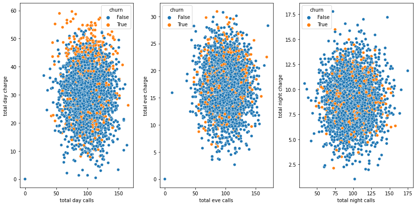
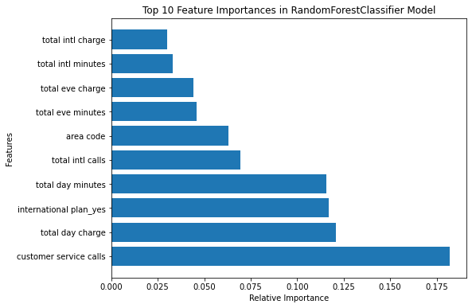

# Syriatel Customer Churn Project

# Project Overview

In the fast-paced telecommunications sector, retaining customers is essential for ensuring sustained growth and profitability. This project focuses on creating a predictive model to identify customers at risk of leaving Syriatel, a prominent telecom provider. Additionally, I will examine the factors driving customer churn to formulate proactive measures for mitigating churn rates. The goal is to adopt a long-term strategy that improves customer satisfaction, boosts loyalty, and expands Syriatel’s market presence.

# Data Understanding

The data for this project was sourced from https://www.kaggle.com/becksddf/churn-in-telecoms-dataset. It comprises 3,333 entries and 21 columns, detailing various aspects of Syriatel's customers, such as call duration, customer service interactions, and churn status among other features. The primary focus of this dataset is to predict customer churn, with the churn column serving as the target variable.

# Data Preparation

The dataset utilized in this project was preprocessed and cleaned beforehand, eliminating the need for additional handling of missing values, outliers, or other data quality issues. However, one preprocessing step involved removing the phone number column from the dataset. This column was considered irrelevant for churn analysis, as it did not offer meaningful insights into customer behavior or contribute to predicting churn. The data was then categorized into categorical and numerical variables for further analysis.

# Exploratory Data Analysis (EDA)

This phase provided valuable insights into the Syriatel Customer Churn dataset, uncovering issues such as class imbalance in the target variable, the effect of international plans on churn, the role of customer service calls, and the relationships between total calls, minutes, and charges. These findings guided the subsequent analysis and model development for the project.

   # 1 .Univariate Analysis
Examined the distribution of the "churn" target variable.
Visualized the number of churned customers across various features, including international plans, area codes, voicemail plans, and customer service interactions.
   # 2 .Bivariate Analysis
Assessed churn rates in relation to international plans, area codes, voicemail plans, and customer service calls
Compared churn rates across different American states.
   # 3 .Multivariate Analysis
Investigated the relationships between total calls, total charges, and different time periods (daytime, evening, nighttime).
Analyzed the connections between total international calls, minutes and charges.

# Preprocessing
In this section, I carry out the data preprocessing steps needed to ready the dataset for model training. I start by creating a duplicate of the churn dataset and examining its contents.

   #  Feature Engineering
I execute the following preprocessing steps:
1. Convert the 'churn' column from boolean to integer to facilitate modeling.
2. Generate dummy variables for categorical features such as 'international plan' and 'voice mail plan.'

Next, I define the predictor variables (X) and the target variable (y) for our machine learning models and proceed to split the dataset into training and testing sets.
Upon observing class imbalance in the 'churn' target variable, I apply SMOTE (Synthetic Minority Over-sampling Technique) to balance the classes through resampling.

# Modeling

In this section, I develop machine learning models to predict customer churn using the following algorithms:

* Logistic Regression
* Decision Tree
* Random Forest
* XGBoost

For each model, I train it on the data, generate predictions and assess its performance using metrics such as accuracy, precision, recall and F1-score.

# Model Evaluation

I evaluate and compare the performance of all the models, selecting the top performers for more in-depth analysis.

# Model Comparison

I assess the performance of each model by comparing their accuracy and recall scores, identifying those with the highest values for both metrics.

# ROC Analysis

I generate ROC curves for all classifiers to visually assess their performance.

# Hyperparameter Tuning

I determine the key features influencing customer churn by analyzing feature importances from the models.

# Feature Importance

I identify the top features contributing to customer churn using feature importances from the models.

The best model for this dataset is the Tuned RandomForestClassifier with the following parameters:
 * max_depth=10, 
 * min_samples_leaf=1, 
 * min_samples_split=2,
 * n_estimators=200,
 * random_state=42

# Summary Findings

1. Voicemail Plan: Most churned customers lacked a voicemail plan.
2. High Call Volume: Churned customers exhibited the highest call volume, with up to 9 calls.
3. Churn Rates by State: California and New Jersey had churn rates above 25%.
4. Day Minutes: Churned customers used more daytime minutes and incurred higher charges.
5. Daytime Charges: Charges for daytime calls were substantially higher compared to evening and nighttime calls.
6. International Plan: Customers with international plans experienced higher churn rates, even though they made fewer international calls.

# Conclusion

1. Most customers who ended their contracts did not have a voicemail plan.
2. California and New Jersey have the highest churn rates, both exceeding 25%.
3. Customers who canceled their accounts tended to use more daytime minutes, leading to increased charges.
4. Daytime call and minute charges were significantly higher than those for evening and nighttime calls and minutes
5. There is a disproportion between the number of international calls made and the associated charges, with higher costs even for fewer calls.
6. Customers with an international plan have a higher churn rate compared to those without such a plan.

# Future Work

* Real-Time Analysis: Establish real-time monitoring and analysis of churn to quickly detect and address potential risks, enabling timely intervention.
* Market Research: Perform market research to stay informed about industry trends, customer preferences, and competitor activities, ensuring the company adapts to shifting market dynamics.
* Customer Feedback Analysis: Evaluate customer feedback from surveys and social media to gain insights into customer sentiments and issues. Use this information to enhance service offerings and improve the overall customer experience.

# For More Information
See the full analysis in the [Juptyer Notebook](Syriatel_Customer_Churn_Project.ipynb) or review the[Presentation](Presentation.pdf)